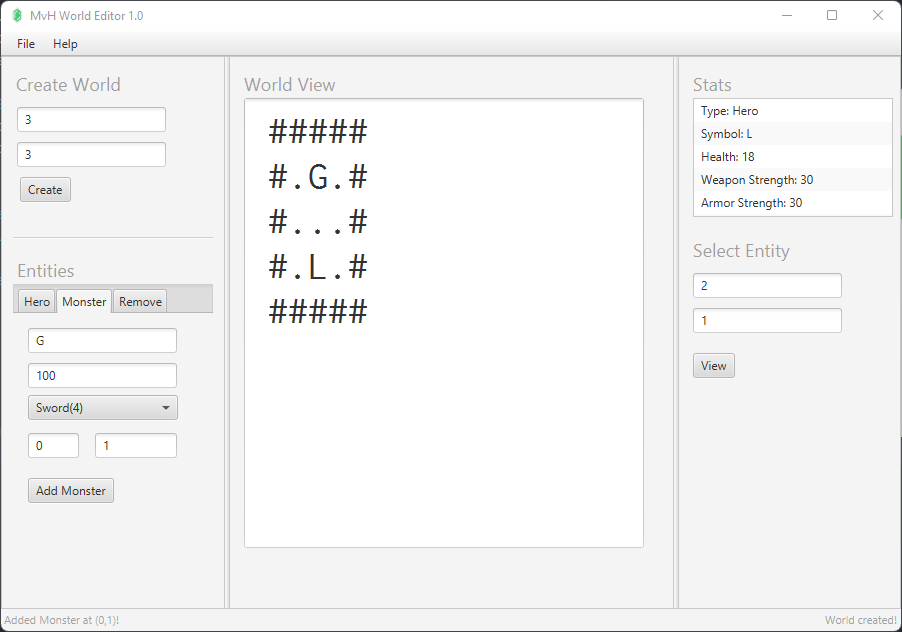

# MvH World Editor (v1.0)

Monsters vs. Heroes (MvH) World Editor is a JavaFX GUI application to create, load, and edit world files for the MvH 
game from Assignment 2

## Program

The program consists of 4 main components:
* **File Menu**
    * Load
    * Save
    * Quit
* **Help Menu**
    * About
* **Create World**
* **Entities**
    * Hero
    * Monster
    * Remove
* **World View**
* **Stats**
* **Select Entity**

### File Menu ###

| Option | Description              |
|--------|--------------------------|
| Load   | Load existing World file |
| Save   | Save new World file      |
| Quit   | Exit program             |

### Help Menu ### 

| Option | Description               |
|--------|---------------------------|
| About  | Shows program information |

### Create World ###
| Option | Description                             |
|--------|-----------------------------------------|
| Row    | Row dimension for new World             |
| Column | Column dimension for new World          |
| Create | Create new World using given dimensions |

### Entities ###

#### Hero #### 
| Option          | Description                       |
|-----------------|-----------------------------------|
| Symbol          | Symbol for new Hero entity        |
| Health          | Health stat for new Hero          |
| Weapon Strength | Weapon Strength stat for new Hero |
| Armor Strength  | Armor Strength stat for new Hero  |
| Row             | Row index for new Hero            |
| Column          | Column index for new Hero         |
| Add Hero        | Add Hero using provided info      |

#### Monster #### 
| Option      | Description                     |
|-------------|---------------------------------|
| Symbol      | Symbol for new Monster entity   |
| Health      | Health stat for new Monster     |
| Weapon      | Weapon Type for new Monster     |
| Row         | Row index for new Monster       |
| Column      | Column index for new Monster    |
| Add Monster | Add Monster using provided info |

#### Remove #### 
| Option | Description                           |
|--------|---------------------------------------|
| Row    | Row index for entity to be removed    |
| Column | Column index for entity to be removed |
| Remove | Remove entity at provided indexes     |

### World View ###
Display World as a String with:
* *Walls* as #
* *Floors* as .
* *Heroes* as their assigned symbol
* *Monsters* as their assigned symbol

### Stats and Select Entity ###
Displays the stats of newly created Hero and Monster entities or entities that
whose row and column index have been provided by *Select Entity*

## Author
### Faisal Islam
#### faisal.islam@ucalgary.ca

